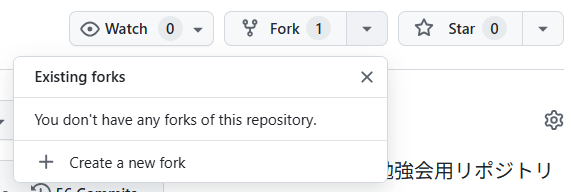
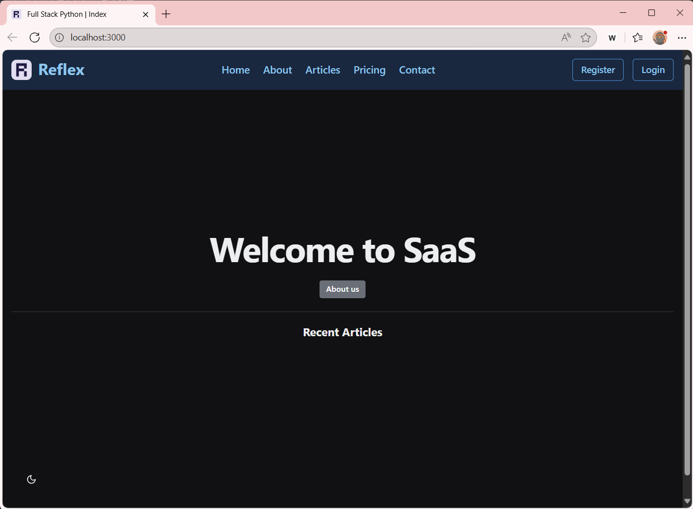

# Reflex MVP アプリ

このサンプルアプリケーションの実行・ビルドに関する手順の解説です。

## ソースコードの入手

現在、ローカルにこのリポジトリを持っていないとします。その場合、WebブラウザでGitHubにあるこのリポジトリを参照していると思いますので、このリポジトリをご自身のアカウントにForkします。



Forkしたリポジトリをローカルにクローンします。
以降は、WSLの環境の利用を前提として、説明を実施いたします。まず、Windows TerminalでWSLの環境へアクセスをします。リポジトリをクローンしたい場所へ移動します。

```bash
# リポジトリをローカルへクローンします。
git clone git@github.com:z2015034/full-stack-python.git
cd full-stack-python

# VS Codeを起動します。
code .
```

VS Codeが起動し、リポジトリの内容が左ペインのExprolerに表示されれば、クローン成功です。


## ローカル実行手順

ローカル環境で実行する前に必要な設定を実施します。

```bash
# 現在のPythonのバージョンを確認します。
python --version

# ここで、3.10.18になっていない場合、pyenvで対象のバージョンをインストールします。
pyenv versions # pyenvでインストールされているバージョンの確認。3.10.18が入って"いない"ことが確認できると思います。
pyenv install 3.10.18
pyenv versions # 再度、確認。3.10.18が入って"いる"ことが確認できると思います。

# 再度、現在のPythonのバージョンを確認してください。
python --version

# 仮想化環境の作成
python -m venv .venv # さまざまな流儀があると思いますが、ここでは.venvとして実行します。また、このプロジェクトの.gitignoreにも.venvで登録してあります。なんらかの事情で別の名前を使用する場合は、適宜、.gitignoreも修正して利用してください。

# 仮想化環境の有効化
source .venv/bin/activate # 成功すると、プロンプトに(.venv)が追加されていれば、成功です。

# Pythonパッケージのインストール
pip install --upgrade pip
pip install -r requirements.txt # これで、Reflexフレームワークと必要な依存関係パッケージがインストールされます。


# データベースの初期化

```bash
# このMVPアプリケーションは、データベースの管理にSQLAlchemy(Alembic)を利用しており、以下のコマンドでデータベースの作成、初期化を実施しておきます。
reflex db init
reflex db makemigrations
reflex db migrate
```


## MVPプロジェクトの実行

MVPアプリケーションを実行します。
```bash
reflex run # Reflexは、.webディレクトリにPythonのコードからReact（Next.js）をベースにしたJavaScriptを生成します。
```

また、このような警告が出ると思いますが、このMVPアプリケーションは、Reflex 0.5.3にもとづいて作成されており、0.8.3にアップグレードすると動作しませんので、ご注意ください。（記法やコマンド体系などが変わっており、プロジェクトのコードの修正が必要になります。）

```bash
Warning: Your version (0.5.3) of reflex is out of date. Upgrade to 0.8.13 with 'pip install reflex --upgrade'
```

以下の出力が得られれば、起動成功です。

```bash
App running at: http://localhost:3000
```

### 動作確認

それでは、動作が出来ているか確認してみましょう。
ますは、バックエンドが動作しているか確認します。

```bash
curl http://127.0.0.1:8000/ping # "pong"とレスポンスがあれば、バックエンドが動作しています。
```

つぎに、Webブラウザで、動作確認をしてみましょう。`http://localhost:3000` へアクセスします。以下のような表示がされれば成功です。




## ビルド手順

Docker環境でフロントエンドとバックエンドを実行する手順です。
ビルドについては、docker_image_build.shにて実行手順をbashスクリプトにまとめてあります。
それほど、複雑なスクリプトではないので、読めばわかると思いますが、一通りの手順を以下にまとめます。

1. ビルド用にPythonの仮想化環境を作成します。
2. ビルドに必要なpipパッケージをインストールします。
3. reflexコマンドでフロントエンド用、バックエンド用のファイルをExportします。
4. Exportされたファイルは、Zipにて生成されるため、それらを解凍します。
5. ビルド用のDockerfileを適切なディレクトリに配置します。
6. Docker Composeでビルドを実行します。
7. Docker Composeで作成したイメージを起動します。

ビルドの実行には、以下のコマンドを実行してください。

```bash
bash docker_image_build.sh
```

## 各種ファイルの説明
ビルドに関連した各種ファイルの役割を解説します。

Docker関連

以下のファイルは、それぞれフロントエンドとバックエンドのDockerfileになります。先に説明したbashスクリプトで、`backend`ディレクトリ、`frontend`ディレクトリに配置されます。
- Dockerfile_frontend
- Dockerfile_backend

docker-composeのファイルです。上記のDokcerfileで作成したコンテナイメージを起動、複数のコンテナの制御をおこないます。
- docker-compose.yml

ローカル環境では、意識しなくてもよかったフロントエンドとバックエンドの連携（アクセスポートでのみ識別）ですが、コンテナイメージ化することで、アクセス先のコンテナを検知する必要があります。そのため、フロントエンドコンテナ内でバックエンドへのアクセスが発生した場合、そのアクセスをどこへルーティングさせるかの情報が必要です。その情報は、Webサーバの設定でリバースプロキシを設定することで実現しています。
bashスクリプトでは、コンテナイメージを作成するタイミングで、コンテナイメージ内のNGINXの設定ファイルを上書きしています。
- nginx.conf


## 動作確認

- バックエンドの確認
  - ブラウザで`http://localhost:8000/ping`を開きます。
  - "pong"と表示されれば動作成功です。

- フロントエンドの確認
  - ブラウザで`http://localhost:3000`を開きます。
  - Reflexアプリが表示されれば動作成功です。

- Dockerコマンドでも動作を確認しておきましょう。
  - 確認用のTerminalをひとつ作成してください。
  - それぞれコマンドで以下のような出力が確認できれば、正しくコンテナが動作しています。

```bash
$ sudo docker images # dockerイメージのリスト
REPOSITORY                          TAG       IMAGE ID       CREATED         SIZE
full-stack-python-reflex-backend    latest    a62603a79d10   7 minutes ago   450MB
full-stack-python-reflex-frontend   latest    620d2c89b0e8   8 minutes ago   54.7MB

$ sudo docker ps -a # dockerコンテナのリスト(停止中のコンテナも含めて表示)
CONTAINER ID   IMAGE                               COMMAND                  CREATED         STATUS         PORTS                                         NAMES
ebaa2b4d8740   full-stack-python-reflex-frontend   "/docker-entrypoint.…"   6 minutes ago   Up 6 minutes   0.0.0.0:3000->80/tcp, [::]:3000->80/tcp       reflex-frontend
8be82646da50   full-stack-python-reflex-backend    "reflex run --backen…"   6 minutes ago   Up 6 minutes   0.0.0.0:8000->8000/tcp, [::]:8000->8000/tcp   reflex-backend

$ sudo docker network ls # dockerネットワークのリスト
NETWORK ID     NAME                               DRIVER    SCOPE
a58b8d998888   bridge                             bridge    local
e5e1b6f4e337   full-stack-python_reflex-network   bridge    local
4a05953a8d35   host                               host      local
007b9988daa0   none                               null      local

$ sudo docker compose ps -a # dockerコンテナのリスト(停止中のコンテナも含めて表示)　docker composeでの表示
NAME              IMAGE                               COMMAND                  SERVICE           CREATED              STATUS              PORTS
reflex-backend    full-stack-python-reflex-backend    "reflex run --backen…"   reflex-backend    About a minute ago   Up About a minute   0.0.0.0:8000->8000/tcp, [::]:8000->8000/tcp
reflex-frontend   full-stack-python-reflex-frontend   "/docker-entrypoint.…"   reflex-frontend   About a minute ago   Up About a minute   0.0.0.0:3000->80/tcp, [::]:3000->80/tcp

$ sudo docker compose ls # dockerネットワークのリスト
NAME                STATUS              CONFIG FILES
full-stack-python   running(2)          /home/{user_dir}/work/full-stack-python/docker-compose.yml

$ sudo docker compose config # docker composeで作成されたコンテナの構成一覧
name: full-stack-python
services:
  reflex-backend:
    build:
      context: /home/{user_dir}/work/full-stack-python
      dockerfile: backend/Dockerfile
    container_name: reflex-backend
    networks:
      reflex-network: null
    ports:
      - mode: ingress
        target: 8000
        published: "8000"
        protocol: tcp
  reflex-frontend:
    build:
      context: /home/{user_dir}/work/full-stack-python
      dockerfile: frontend/Dockerfile
    container_name: reflex-frontend
    depends_on:
      reflex-backend:
        condition: service_started
        required: true
    networks:
      reflex-network: null
    ports:
      - mode: ingress
        target: 80
        published: "3000"
        protocol: tcp
networks:
  reflex-network:
    name: full-stack-python_reflex-network
    driver: bridge
```

## Dockerコンテナの削除

現在動作中のコンテナをすべて停止し、かつコンテナイメージを削除します。

```bash
sudo docker compose down --rmi all

# 以下のコマンドで不要なリソースが削除されていることを確認します。
sudo docker compose ps -a
sudo docker network ls
sudo docker volume ls
sudo docker images
```

注意: `sudo docker network ls`を実行すると、以下のように複数のネットワークが確認できると思いますが、これらはDockerが利用する内部用のネットワーク（コンテナ間通信やホストとの通信など）ですので、残っていても問題ありません。

```
$ sudo docker network ls
NETWORK ID     NAME      DRIVER    SCOPE
a58b8d998888   bridge    bridge    local
4a05953a8d35   host      host      local
007b9988daa0   none      null      local
```
