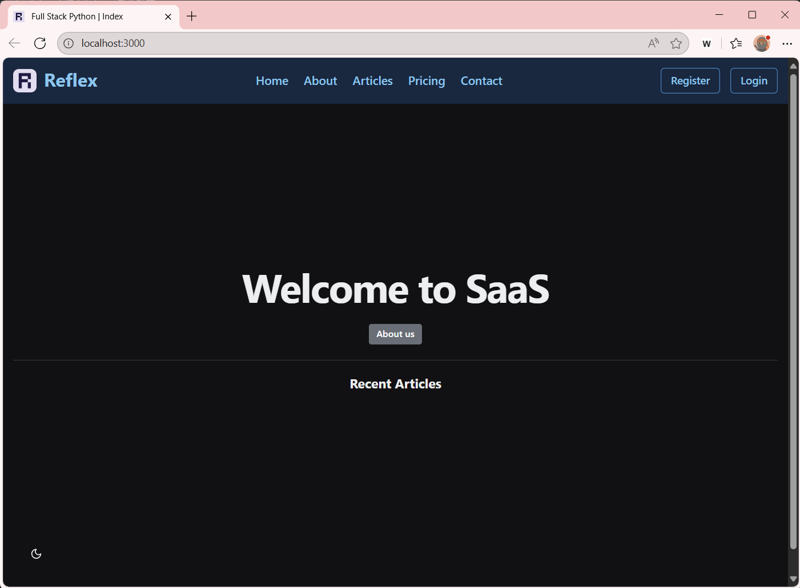

# Reflex MVP アプリ

このサンプルアプリケーションの実行・ビルドに関する手順の解説です。

## ソースコードの入手

現在、ローカルにこのリポジトリを持っていないとします。その場合、WebブラウザでGitHubにあるこのリポジトリを参照していると思いますので、このリポジトリをローカルにクローンします。
WSLの環境の利用を前提として、説明を実施いたします。まず、Windows TerminalでWSLの環境へアクセスをします。リポジトリをクローンしたい場所へ移動します。

```bash
# リポジトリをローカルへクローンします。
git clone git@github.com:z2015034/full-stack-python.git
cd full-stack-python

# VS Codeを起動します。
code .
```

VS Codeが起動し、リポジトリの内容が左ペインのExprolerに表示されれば、クローン成功です。


## ローカル実行手順

ローカル環境で実行する前に必要な設定を実施します。

```bash
# 現在のPythonのバージョンを確認します。
python --version

# ここで、3.10.18になっていない場合、pyenvで対象のバージョンをインストールします。
pyenv versions # pyenvでインストールされているバージョンの確認。3.10.18が入って"いない"ことが確認できると思います。
pyenv install 3.10.18
pyenv versions # 再度、確認。3.10.18が入って"いる"ことが確認できると思います。

# 再度、現在のPythonのバージョンを確認してください。
python --version

# 仮想化環境の作成
python -m venv .venv # さまざまな流儀があると思いますが、ここでは.venvとして実行します。また、このプロジェクトの.gitignoreにも.venvで登録してあります。なんらかの事情で別の名前を使用する場合は、適宜、.gitignoreも修正して利用してください。

# 仮想化環境の有効化
source .venv/bin/actibate # 成功すると、プロンプトに(.venv)が追加されていれば、成功です。

# Pythonパッケージのインストール
pip install --upgrade pip
pip install -r requirements.txt # これで、Reflexフレームワークと必要な依存関係パッケージがインストールされます。


# ---
# nodeがインストールされていなくとも、Reflex実行時にインストールされますが、事前にインストールしておくとビルドの時間が短縮されます。
# また、将来的にAIの利活用などで、nodeやnpmのお世話になる機会も多いため、nodeは入れておきましょう。

# nodeのインストール確認
node --version
nvm list

# データベースの初期化

```bash
# このMVPアプリケーションは、データベースの管理にSQLAlchemy(Alembic)を利用しており、以下のコマンドでデータベースの作成、初期化を実施しておきます。
reflex db init
reflex db makemigrations
reflex db migrate
```


# MVPプロジェクトの実行

MVPアプリケーションを実行します。
```bash
reflex run # Reflexは、.webディレクトリにPythonのコードからReact（Next.js）をベースにしたJavaScriptを生成します。
```

また、このような警告が出ると思いますが、このMVPアプリケーションは、Reflex 0.5.3にもとづいて作成されており、0.8.3にアップグレードすると動作しませんので、ご注意ください。（記法やコマンド体系などが変わっており、プロジェクトのコードの修正が必要になります。）

```bash
Warning: Your version (0.5.3) of reflex is out of date. Upgrade to 0.8.13 with 'pip install reflex --upgrade'
```

以下の出力が得られれば、起動成功です。

```bash
App running at: http://localhost:3000
```

### 動作確認

それでは、動作が出来ているか確認してみましょう。
ますは、バックエンドが動作しているか確認します。

```bash
curl http://127.0.0.1:8000/ping # "pong"とレスポンスがあれば、バックエンドが動作しています。
```

つぎに、Webブラウザで、動作確認をしてみましょう。`http://localhost:3000` へアクセスします。以下のような表示がされれば成功です。




## ビルド手順

Docker環境でフロントエンドとバックエンドを実行する手順です。
ローカル実行をせずにビルドのみ実行する場合、

```bash
reflex export # backend.zip, frontend.zipが生成されます。

# 生成されたzipファイルを展開します。
unzip backend.zip -d backend
unzip frontend.zip -d frontend
```

backend, frontendディレクトリ配下にDockerfileを作成します。

backend用 Dockerfile
```Dockerfile
# backend/Dockerfile
FROM python:3.10-slim

WORKDIR /app

# Install dependencies
COPY requirements.txt .
RUN pip install --no-cache-dir -r requirements.txt

# Copy the application code (including rxconfig.py)
COPY . .

# Reflex uses uvicorn (0.5.3 では run で起動)
EXPOSE 8000

CMD ["reflex", "run", "--backend-only", "--env", "prod", "--backend-port", "8000"]
```

frontend用 DOckerfile
```Dockerfile
# frontend/Dockerfile
FROM nginx:alpine

# Remove default conf
RUN rm /etc/nginx/conf.d/default.conf

# Copy your exported frontend build (from reflex export)
COPY . /usr/share/nginx/html

# Copy nginx configuration
COPY nginx.conf /etc/nginx/conf.d/default.conf

EXPOSE 80
CMD ["nginx", "-g", "daemon off;"]
```

また、これらのコンテナを統制するdocker-composeファイルを作成します。

```yaml
services:
  reflex-backend:
    build:
      context: .
      dockerfile: backend/Dockerfile
    container_name: reflex-backend
    ports:
      - "8000:8000"
    networks:
      - reflex-network

  reflex-frontend:
    build:
      context: .
      dockerfile: frontend/Dockerfile
    container_name: reflex-frontend
    ports:
      - "3000:80"
    depends_on:
      - reflex-backend
    networks:
      - reflex-network

networks:
  reflex-network:
    driver: bridge
```


また、フロントエンドの参照パスをローカル実行用ではなく、コンテナ用に参照先を変更するため、nginx.confを用意しておきます。（このリポジトリでは、すでに用意済み）

```conf
# frontend/nginx.conf
server {
    listen 80;
    server_name localhost;

    # Serve static frontend files
    location / {
        root   /usr/share/nginx/html;
        index  index.html index.htm;
        try_files $uri $uri/ /index.html;
    }

    # Proxy API calls to backend
    location /_api/ {
        proxy_pass         http://reflex-backend:8000;
        proxy_http_version 1.1;
        proxy_set_header   Upgrade $http_upgrade;
        proxy_set_header   Connection "upgrade";
        proxy_set_header   Host $host;
    }
}
```

コンテナ用に参照先を変更とは、バックエンド用のコンテナを別に作成するため、そのコンテナへアクセスする必要があるため。ローカル実行では、ポート番号違いで、おなじlocalhostを参照している。